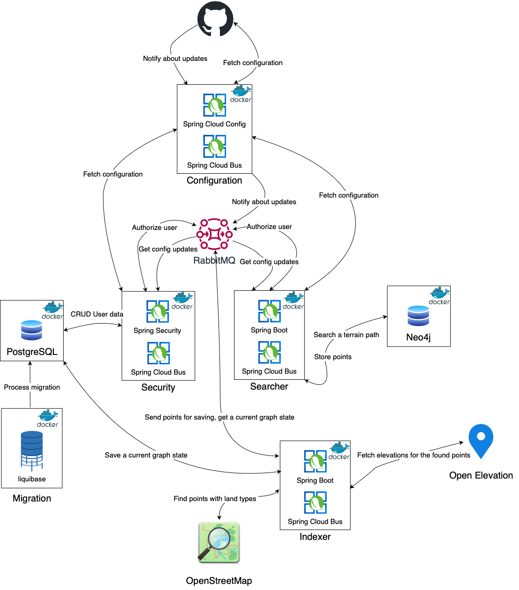

# Path Finder

This service allows you to find the shortest path between two points on rough terrain.

# Backend Architecture

# Installation

Currently, only installation using Kubernetes is supported.

1. Set up a Git repository with the configuration. One can find an example of the configuration in the
   folder `deploy/git`.
2. Set up a k8s cluster using the helm chart in the folder `deploy/helm`.